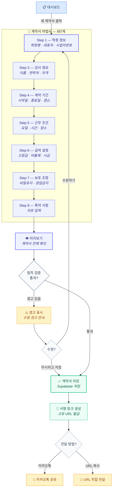
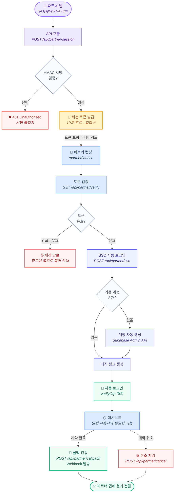
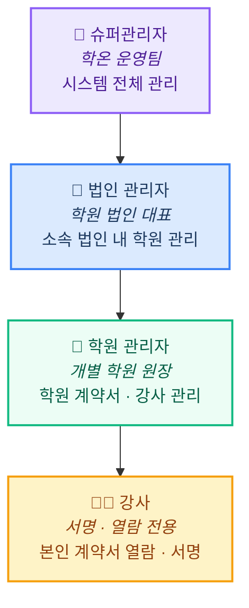

# 학온(HAGON) 전체 플로우차트

서비스 전체 흐름을 시각적으로 정리한 문서입니다.
각 섹션은 독립된 다이어그램으로 구성되어 있으며, 분기(다이아몬드) 노드로 의사결정 지점을 명확히 표시합니다.

---

## 📌 범례

| 색상 | 의미 | 사용 예시 |
|------|------|----------|
| 🟦 인디고 | 핵심 프로세스 | 계약서 마법사, 로그인, 전자서명 |
| 🟩 에메랄드 | 완료 · 성공 | 저장 완료, 서명 완료, 자동 로그인 |
| 🟨 앰버 | 알림 · 전송 | 서명 링크 전송, 카카오톡, 세션 토큰 |
| 🟥 레드 | 에러 · 거부 | 인증 실패, 서명 거부, 세션 만료 |
| 🔵 블루 | 서비스 화면 | 대시보드, 계약서 조회, 런칭 페이지 |
| 🟣 퍼플 | 관리자 · 파트너 | 총관리자, 학원관리자, 파트너 앱 |
| ⬜ 회색 | 분기 · 판단 | 인증 성공?, 역할 확인, 토큰 유효? |

---

## 1. 전체 서비스 통합 플로우

학원 원장이 서비스에 접속하여 계약서를 작성하고, 강사가 전자서명을 완료하기까지의 전체 여정입니다.
**직접 접속**과 **파트너 연동(SSO)** 두 가지 진입 경로를 함께 표시합니다.

```mermaid
flowchart TD
    subgraph ENTRY [🚪 서비스 진입]
        START([🚀 서비스 접속]) --> LANDING[🏠 랜딩 페이지<br/><i>서비스 소개 · 요금 안내</i>]
        LANDING -->|시작하기 클릭| LOGIN[🔐 로그인 · 회원가입<br/><i>/login</i>]

        PARTNER([🏢 파트너 앱<br/><i>TeamPro 등</i>]) -->|API 호출| TOKEN[🔑 세션 토큰 발급<br/><i>HMAC 서명 검증</i>]
        TOKEN --> SSO[🔗 SSO 자동 로그인]
    end

    LOGIN --> AUTH{인증<br/>성공?}
    AUTH -->|실패| LOGIN
    AUTH -->|성공| DASHBOARD
    SSO --> DASHBOARD

    DASHBOARD[📋 대시보드<br/><i>/dashboard</i><br/>계약서 목록 · 진행 현황]

    DASHBOARD -->|새 계약서| WIZARD[📝 계약서 마법사<br/><i>8단계 작성</i>]
    DASHBOARD -->|기존 계약서 클릭| VIEW[📄 계약서 조회<br/><i>/view/[id]</i>]

    WIZARD --> PREVIEW[👁️ 미리보기<br/><i>전체 계약 내용 확인</i>]
    PREVIEW --> SAVE_CHECK{저장<br/>확인?}
    SAVE_CHECK -->|수정 필요| WIZARD
    SAVE_CHECK -->|확인| COMPLETE[✅ 저장 완료<br/><i>서명 링크 생성</i>]

    COMPLETE --> SEND[📱 서명 링크 전송<br/><i>카카오톡 · URL 복사</i>]
    SEND --> SIGN[✍️ 강사 전자서명<br/><i>/sign/[id]</i>]
    SIGN --> RESULT{서명<br/>결과}
    RESULT -->|서명 완료| SUCCESS([🎉 계약 체결 완료])
    RESULT -->|거부 · 만료| FAILED[❌ 서명 미완료]

    SUCCESS --> VIEW
    SUCCESS -.->|파트너 경유 시| CALLBACK[📡 파트너 콜백<br/><i>계약 완료 알림</i>]

    style START fill:#eef2ff,stroke:#6366f1,stroke-width:2px,color:#312e81
    style LANDING fill:#dbeafe,stroke:#3b82f6,stroke-width:1px,color:#1e3a5f
    style LOGIN fill:#eef2ff,stroke:#6366f1,stroke-width:2px,color:#312e81
    style PARTNER fill:#ede9fe,stroke:#8b5cf6,stroke-width:2px,color:#4c1d95
    style TOKEN fill:#fef3c7,stroke:#f59e0b,stroke-width:1px,color:#92400e
    style SSO fill:#ecfdf5,stroke:#10b981,stroke-width:1px,color:#065f46
    style AUTH fill:#f8fafc,stroke:#94a3b8,stroke-width:2px,color:#334155
    style DASHBOARD fill:#dbeafe,stroke:#3b82f6,stroke-width:2px,color:#1e3a5f
    style WIZARD fill:#eef2ff,stroke:#6366f1,stroke-width:2px,color:#312e81
    style VIEW fill:#dbeafe,stroke:#3b82f6,stroke-width:1px,color:#1e3a5f
    style PREVIEW fill:#eef2ff,stroke:#6366f1,stroke-width:1px,color:#312e81
    style SAVE_CHECK fill:#f8fafc,stroke:#94a3b8,stroke-width:2px,color:#334155
    style COMPLETE fill:#ecfdf5,stroke:#10b981,stroke-width:2px,color:#065f46
    style SEND fill:#fef3c7,stroke:#f59e0b,stroke-width:1px,color:#92400e
    style SIGN fill:#eef2ff,stroke:#6366f1,stroke-width:2px,color:#312e81
    style RESULT fill:#f8fafc,stroke:#94a3b8,stroke-width:2px,color:#334155
    style SUCCESS fill:#ecfdf5,stroke:#10b981,stroke-width:2px,color:#065f46
    style FAILED fill:#fef2f2,stroke:#ef4444,stroke-width:1px,color:#991b1b
    style CALLBACK fill:#ede9fe,stroke:#8b5cf6,stroke-width:1px,color:#4c1d95
```

---

## 2. 계약서 작성 상세 플로우

대시보드에서 "새 계약서"를 클릭한 후, 마법사 8단계를 거쳐 계약서를 완성하는 상세 프로세스입니다.
각 단계에서 이전 단계로 돌아가 수정할 수 있으며, Zustand persist로 데이터가 유지됩니다.



---

## 3. 전자서명 프로세스

계약서 저장 후 강사에게 서명 링크가 전달되고, 강사가 서명을 완료하는 과정입니다.
강사는 별도 로그인 없이 서명 링크로 직접 접근합니다.

```mermaid
flowchart TD
    SEND[📱 서명 링크 전송<br/><i>카카오톡 또는 URL</i>]
    SEND --> OPEN[강사가 링크 클릭<br/><i>/sign/[id]</i>]
    OPEN --> REVIEW[📋 계약 내용 확인<br/><i>전체 조항 열람</i>]
    REVIEW --> AGREE{계약 내용<br/>동의?}

    AGREE -->|동의| SIGN[✍️ 전자서명 입력<br/><i>터치 또는 마우스 서명</i>]
    AGREE -->|거부| REJECT[❌ 서명 거부]

    SIGN --> DONE([🎉 서명 완료<br/><i>/sign/[id]/success</i>])

    DONE --> PDF[📄 PDF 다운로드<br/><i>서명 포함 계약서</i>]
    DONE --> DASH_UPDATE[📋 대시보드 반영<br/><i>계약 상태 업데이트</i>]

    REJECT --> NOTIFY[📱 원장에게 알림<br/><i>거부 사유 전달</i>]

    style SEND fill:#fef3c7,stroke:#f59e0b,stroke-width:1px,color:#92400e
    style OPEN fill:#dbeafe,stroke:#3b82f6,stroke-width:1px,color:#1e3a5f
    style REVIEW fill:#dbeafe,stroke:#3b82f6,stroke-width:2px,color:#1e3a5f
    style AGREE fill:#f8fafc,stroke:#94a3b8,stroke-width:2px,color:#334155
    style SIGN fill:#eef2ff,stroke:#6366f1,stroke-width:2px,color:#312e81
    style REJECT fill:#fef2f2,stroke:#ef4444,stroke-width:1px,color:#991b1b
    style DONE fill:#ecfdf5,stroke:#10b981,stroke-width:2px,color:#065f46
    style PDF fill:#ecfdf5,stroke:#10b981,stroke-width:1px,color:#065f46
    style DASH_UPDATE fill:#dbeafe,stroke:#3b82f6,stroke-width:1px,color:#1e3a5f
    style NOTIFY fill:#fef3c7,stroke:#f59e0b,stroke-width:1px,color:#92400e
```

---

## 4. 파트너 연동 상세 플로우

학원관리 프로그램(TeamPro 등)에서 학온으로 연동되는 상세 흐름입니다.
HMAC-SHA256 서명 검증 → 세션 토큰 발급 → SSO 자동 로그인 → 대시보드 진입 순서로 진행됩니다.



---

## 5. Phase 2 — 역할별 권한 분기

Phase 2에서 추가되는 RBAC(역할 기반 접근 제어) 시스템입니다.
로그인 후 사용자 역할에 따라 다른 대시보드와 메뉴로 분기합니다.

```mermaid
flowchart TD
    LOGIN[🔐 로그인] --> ROLE{역할 확인}

    ROLE -->|슈퍼관리자| ADMIN[🛡️ 총관리자 대시보드<br/><i>/admin</i>]
    ROLE -->|학원 관리자| ACADEMY[🏫 학원 관리자 대시보드<br/><i>/academy/[id]/dashboard</i>]
    ROLE -->|강사| TEACHER[👨‍🏫 강사 대시보드<br/><i>/dashboard</i>]

    ADMIN --> ADMIN_MENU

    subgraph ADMIN_MENU [🛡️ 총관리자 메뉴]
        AM1[🏫 학원 관리<br/><i>/admin/academies</i><br/>학원 CRUD · 검색 · 필터]
        AM2[💳 구독 · 요금<br/><i>/admin/subscriptions</i><br/>플랜 과금 · 결제 관리]
        AM3[👥 사용자 관리<br/><i>/admin/users</i><br/>회원 목록 · 권한 설정]
    end

    ACADEMY --> ACAD_MENU

    subgraph ACAD_MENU [🏫 학원 관리자 메뉴]
        AC1[📋 계약서 관리<br/><i>/academy/[id]/contracts</i><br/>학원 내 계약서 통합 관리]
        AC2[👨‍🏫 강사 관리<br/><i>/academy/[id]/staff</i><br/>강사 목록 · 계약 이력]
        AC3[⏰ D-Day 알림<br/><i>만료 예정 계약 확인</i>]
    end

    TEACHER --> TEACH_MENU

    subgraph TEACH_MENU [👨‍🏫 강사 메뉴]
        T1[📄 내 계약서<br/><i>본인 계약서 열람</i>]
        T2[✍️ 전자서명<br/><i>서명 대기 계약서</i>]
        T3[📥 PDF 다운로드<br/><i>서명 완료 계약서</i>]
    end

    style LOGIN fill:#fef3c7,stroke:#f59e0b,stroke-width:2px,color:#92400e
    style ROLE fill:#f8fafc,stroke:#94a3b8,stroke-width:2px,color:#334155
    style ADMIN fill:#ede9fe,stroke:#8b5cf6,stroke-width:2px,color:#4c1d95
    style ACADEMY fill:#dbeafe,stroke:#3b82f6,stroke-width:2px,color:#1e3a5f
    style TEACHER fill:#ecfdf5,stroke:#10b981,stroke-width:2px,color:#065f46
    style AM1 fill:#ede9fe,stroke:#8b5cf6,stroke-width:1px,color:#4c1d95
    style AM2 fill:#ede9fe,stroke:#8b5cf6,stroke-width:1px,color:#4c1d95
    style AM3 fill:#ede9fe,stroke:#8b5cf6,stroke-width:1px,color:#4c1d95
    style AC1 fill:#dbeafe,stroke:#3b82f6,stroke-width:1px,color:#1e3a5f
    style AC2 fill:#dbeafe,stroke:#3b82f6,stroke-width:1px,color:#1e3a5f
    style AC3 fill:#dbeafe,stroke:#3b82f6,stroke-width:1px,color:#1e3a5f
    style T1 fill:#ecfdf5,stroke:#10b981,stroke-width:1px,color:#065f46
    style T2 fill:#ecfdf5,stroke:#10b981,stroke-width:1px,color:#065f46
    style T3 fill:#ecfdf5,stroke:#10b981,stroke-width:1px,color:#065f46
```

### 회원 계층 구조



---

## 6. 계약서 상태 전이도

계약서가 생성되어 최종 완료되기까지의 상태 변화를 나타냅니다.

```mermaid
stateDiagram-v2
    [*] --> WRITING: 새 계약서 시작

    state "작성중" as WRITING {
        [*] --> S1
        S1: Step 1 - 학원 정보
        S1 --> S3: 다음
        S3: Step 3 - 강사 정보
        S3 --> S4_8: 다음
        S4_8: Step 4~8 - 계약 상세
    }

    WRITING --> PREVIEW: 마지막 단계 완료
    state "미리보기" as PREVIEW
    PREVIEW --> WRITING: 수정 필요

    PREVIEW --> SAVED: 저장 확인

    state "저장완료" as SAVED {
        [*] --> LINK_GEN
        LINK_GEN: 서명 링크 URL 생성
        LINK_GEN --> LINK_SEND
        LINK_SEND: 카카오톡 또는 URL 전달
    }

    SAVED --> PENDING: 강사에게 링크 전송
    state "서명대기" as PENDING

    PENDING --> SIGNED: 강사가 전자서명
    state "서명완료" as SIGNED
    PENDING --> REJECTED: 강사가 거부
    state "서명거부" as REJECTED
    PENDING --> EXPIRED: 서명 기한 초과
    state "만료" as EXPIRED

    SIGNED --> [*]
    REJECTED --> [*]
    EXPIRED --> [*]

    note right of WRITING
        Zustand persist로
        페이지 이동 시 데이터 유지
    end note

    note right of PENDING
        강사는 별도 로그인 없이
        서명 링크로 직접 접근
    end note

---

## 7. Phase별 기능 비교

| 구분 | MVP (현재) | Phase 1 (고도화) | Phase 2 (관리 시스템) |
|------|-----------|-----------------|---------------------|
| **계약서 작성** | ✅ 마법사 8단계 기본 | 🔄 UI/UX 리뉴얼 · 템플릿 v7 | — |
| **미리보기** | ✅ 기본 레이아웃 | 🔄 조항 순서 정리 · 급여 테이블 개선 | — |
| **대시보드** | ✅ 계약서 목록 | 🔄 통계 카드 + 고급 필터 | — |
| **전자서명** | ✅ 기본 서명 | 🔄 플로우 안정화 | — |
| **PDF** | ✅ 기본 출력 | 🔄 고품질 + 서명란 개선 | — |
| **파트너 연동** | ✅ SSO + Webhook | — | — |
| **총관리자** | — | — | 🆕 학원 관리 · 구독 · 사용자 |
| **학원관리자** | — | — | 🆕 계약서 통합 · 강사 관리 |
| **RBAC** | — | — | 🆕 역할별 권한 분기 |
| **D-Day 알림** | — | — | 🆕 만료 예정 계약 알림 |
| **인사서류** | — | — | 🆕 Phase 3 (5개 서랍 · 26종+) |

> ✅ 구현 완료 &nbsp;&nbsp; 🔄 개선 예정 &nbsp;&nbsp; 🆕 신규 개발

---

## 8. 주요 사용자 시나리오

### 시나리오 A — 신규 학원 직접 가입

1. 학원 원장이 랜딩 페이지 방문
2. 회원가입 → 로그인
3. 대시보드 진입, "새 계약서" 클릭
4. 마법사 8단계 작성 (학원정보 → 강사정보 → 계약기간 → 근무조건 → 급여 → 보호조항 → 특약)
5. 미리보기에서 법적 검증 확인
6. 저장 → 서명 링크를 카카오톡으로 강사에게 전송
7. 강사가 링크 클릭 → 계약 내용 확인 → 전자서명
8. 계약 체결 완료, PDF 다운로드 가능

### 시나리오 B — 파트너 연동 학원

1. 학원관리 프로그램(TeamPro)에서 "학온 계약서 작성" 버튼 클릭
2. HMAC 서명으로 세션 토큰 발급
3. SSO 자동 로그인 → 대시보드 진입
4. 이후 시나리오 A의 3~8번과 동일
5. 계약 완료 시 파트너 앱에 Webhook 콜백 전송

### 시나리오 C — 강사 서명 (Phase 2)

1. 카카오톡으로 서명 링크 수신
2. 링크 클릭 → 계약 내용 전체 확인
3. 동의 시 전자서명 입력 → 계약 체결
4. 이후 강사 대시보드에서 본인 계약서 열람 가능

---

## 화면 간 이동 경로 요약

### 공개 → 인증

| 출발 | 도착 | 조건 |
|------|------|------|
| `/` (랜딩) | `/login` | "시작하기" 클릭 |
| `/login` | `/dashboard` | 로그인 성공 (일반/학원관리자) |
| `/login` | `/admin` | 로그인 성공 (슈퍼관리자, Phase 2) |

### 대시보드 → 계약서

| 출발 | 도착 | 조건 |
|------|------|------|
| `/dashboard` | `/wizard/type-a/step-1` | "새 계약서" 클릭 |
| `/wizard/type-a/step-N` | `/wizard/type-a/step-N+1` | 다음 단계 |
| `/wizard/type-a/preview` | `/wizard/type-a/complete` | 계약서 저장 |
| `/dashboard` | `/view/[id]` | 계약서 클릭 (조회) |

### 전자서명

| 출발 | 도착 | 조건 |
|------|------|------|
| 카카오톡/URL | `/sign/[id]` | 강사가 서명 링크 클릭 |
| `/sign/[id]` | `/sign/[id]/success` | 서명 완료 |

### 파트너 연동

| 출발 | 도착 | 조건 |
|------|------|------|
| 파트너 앱 | `/partner/launch` | SSO 토큰 포함 리다이렉트 |
| `/partner/launch` | `/dashboard` | 자동 로그인 완료 |

### Phase 2 관리자

| 출발 | 도착 | 조건 |
|------|------|------|
| `/admin` | `/admin/academies` | 학원 관리 메뉴 |
| `/admin` | `/admin/subscriptions` | 구독 관리 메뉴 |
| `/admin` | `/admin/users` | 사용자 관리 메뉴 |
| `/academy/[id]/dashboard` | `/academy/[id]/contracts` | 계약서 관리 메뉴 |
| `/academy/[id]/dashboard` | `/academy/[id]/staff` | 강사 관리 메뉴 |
