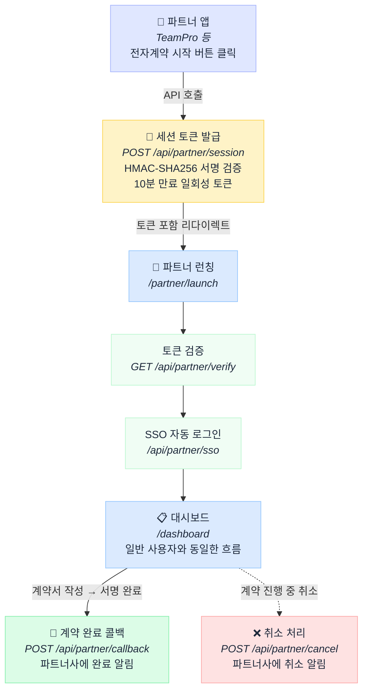
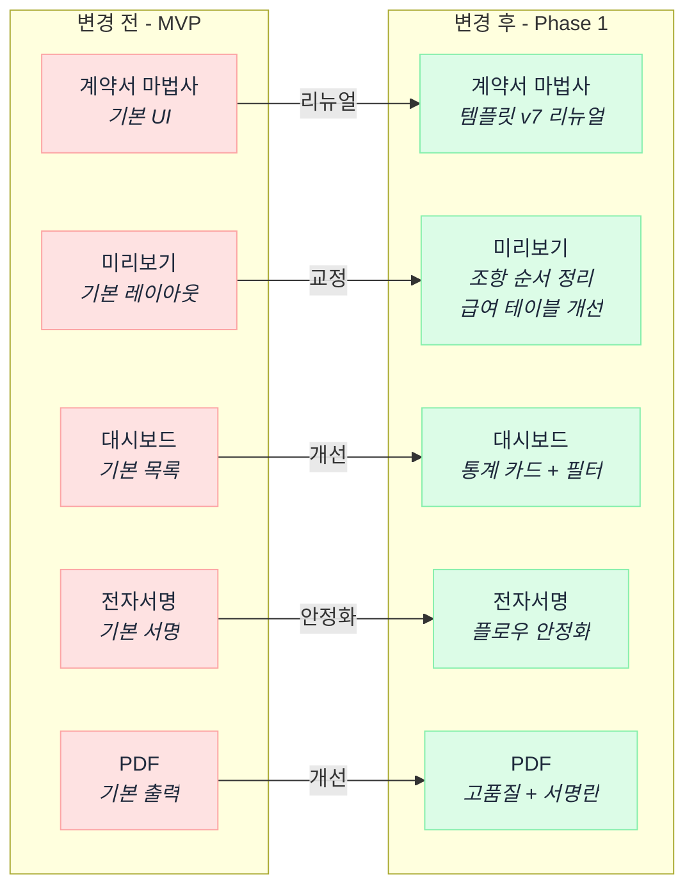
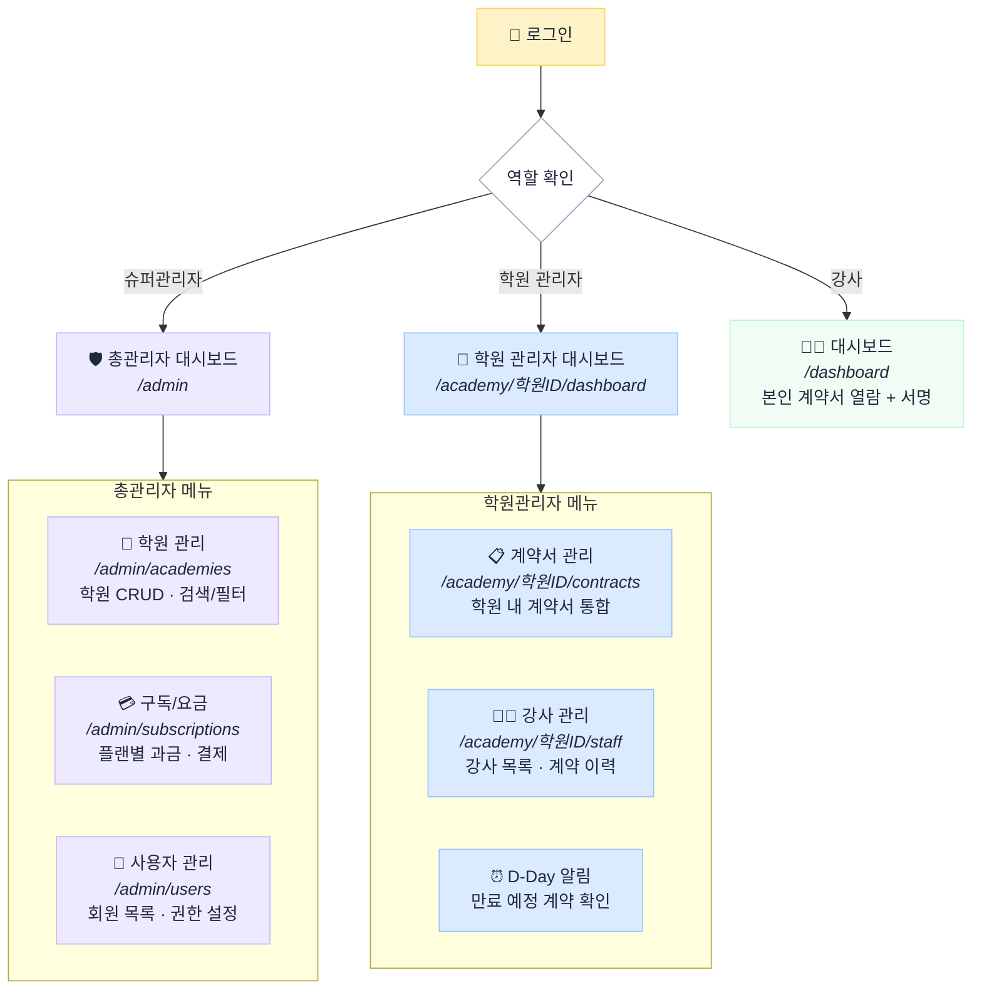
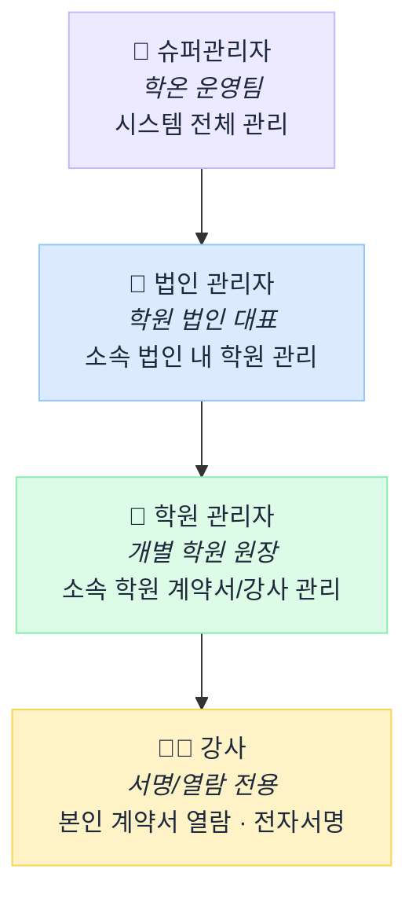
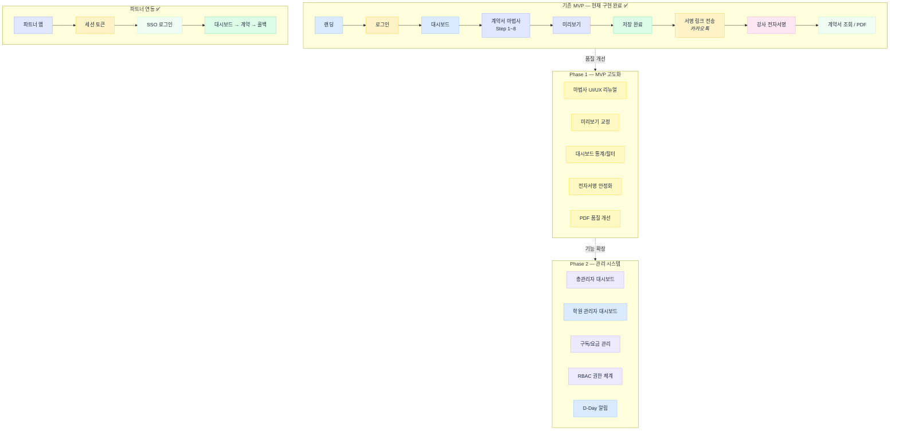

# 학온(HAGON) 전체 플로우차트

서비스 전체 흐름을 Phase별로 정리한 문서입니다.

---

## 기존 MVP — 계약서 작성 플로우

학원 원장이 새 강사와 계약할 때의 전체 흐름입니다.

```mermaid
flowchart TD
    START(( )) --> LANDING[🏠 랜딩 페이지<br/><i>서비스 소개 · 기능 · 가격</i>]
    LANDING -->|시작하기 클릭| LOGIN[🔐 로그인 / 회원가입<br/><i>/login</i>]

    LOGIN -->|로그인 성공| DASHBOARD[📋 대시보드<br/><i>/dashboard</i><br/>계약서 목록 · 진행중/완료 탭<br/>검색 · 카카오 공유]

    DASHBOARD -->|새 계약서 클릭| WIZARD_START

    subgraph WIZARD [📝 계약서 마법사]
        direction LR
        WIZARD_START[Step 1<br/>학원 정보] --> STEP3[Step 3<br/>강사 정보]
        STEP3 --> STEP4[Step 4<br/>계약기간]
        STEP4 --> STEP5[Step 5<br/>근무조건]
        STEP5 --> STEP6[Step 6<br/>급여 설정<br/><i>고정/비율/시급</i>]
        STEP6 --> STEP7[Step 7<br/>보호조항]
        STEP7 --> STEP8[Step 8<br/>특약사항]
        STEP8 --> PREVIEW[미리보기<br/>+ 법적 검증]
        PREVIEW --> COMPLETE[✅ 저장 완료<br/>서명 링크 생성]
    end

    COMPLETE -->|서명 링크 전송| SEND[📱 카카오톡 / URL<br/>서명 링크 전달]
    SEND -->|강사가 링크 클릭| SIGN[✍️ 전자서명<br/><i>/sign/계약ID</i><br/>계약 내용 확인 → 서명]
    SIGN -->|서명 완료| SUCCESS[🎉 서명 완료<br/><i>/sign/계약ID/success</i>]
    SUCCESS --> VIEW[📄 계약서 조회<br/><i>/view/계약ID</i><br/>읽기전용 · PDF 다운로드]

    style LANDING fill:#dbeafe,stroke:#93c5fd,color:#1e293b
    style LOGIN fill:#fef3c7,stroke:#fcd34d,color:#1e293b
    style DASHBOARD fill:#dbeafe,stroke:#93c5fd,color:#1e293b
    style WIZARD_START fill:#e0e7ff,stroke:#a5b4fc,color:#1e293b
    style STEP3 fill:#e0e7ff,stroke:#a5b4fc,color:#1e293b
    style STEP4 fill:#e0e7ff,stroke:#a5b4fc,color:#1e293b
    style STEP5 fill:#e0e7ff,stroke:#a5b4fc,color:#1e293b
    style STEP6 fill:#e0e7ff,stroke:#a5b4fc,color:#1e293b
    style STEP7 fill:#e0e7ff,stroke:#a5b4fc,color:#1e293b
    style STEP8 fill:#e0e7ff,stroke:#a5b4fc,color:#1e293b
    style PREVIEW fill:#e0e7ff,stroke:#a5b4fc,color:#1e293b
    style COMPLETE fill:#dcfce7,stroke:#86efac,color:#1e293b
    style SEND fill:#fef3c7,stroke:#fcd34d,color:#1e293b
    style SIGN fill:#fce7f3,stroke:#f9a8d4,color:#1e293b
    style SUCCESS fill:#dcfce7,stroke:#86efac,color:#1e293b
    style VIEW fill:#f0fdf4,stroke:#bbf7d0,color:#1e293b
```

---

## 기존 MVP — 파트너 연동 플로우

학원관리 프로그램(TeamPro 등)에서 학온으로 연동되는 흐름입니다.

---

## Phase 1 — MVP 고도화

기존 MVP의 품질을 높이는 단계입니다. 새로운 페이지 추가 없이 기존 화면을 개선합니다.

---

## Phase 2 — RBAC 권한 분기 플로우

로그인 후 역할에 따라 다른 화면으로 이동합니다.

---

## Phase 2 — 회원 계층 구조

---

## 전체 Phase 통합 요약

---

## 화면 간 이동 경로 요약

### 공개 → 인증

| 출발 | 도착 | 조건 |
|------|------|------|
| `/` (랜딩) | `/login` | "시작하기" 클릭 |
| `/login` | `/dashboard` | 로그인 성공 (일반/학원관리자) |
| `/login` | `/admin` | 로그인 성공 (슈퍼관리자, Phase 2) |

### 대시보드 → 계약서

| 출발 | 도착 | 조건 |
|------|------|------|
| `/dashboard` | `/wizard/type-a/step-1` | "새 계약서" 클릭 |
| `/wizard/type-a/step-N` | `/wizard/type-a/step-N+1` | 다음 단계 |
| `/wizard/type-a/preview` | `/wizard/type-a/complete` | 계약서 저장 |
| `/dashboard` | `/view/[id]` | 계약서 클릭 (조회) |

### 전자서명

| 출발 | 도착 | 조건 |
|------|------|------|
| 카카오톡/URL | `/sign/[id]` | 강사가 서명 링크 클릭 |
| `/sign/[id]` | `/sign/[id]/success` | 서명 완료 |

### 파트너 연동

| 출발 | 도착 | 조건 |
|------|------|------|
| 파트너 앱 | `/partner/launch` | SSO 토큰 포함 리다이렉트 |
| `/partner/launch` | `/dashboard` | 자동 로그인 완료 |

### Phase 2 관리자

| 출발 | 도착 | 조건 |
|------|------|------|
| `/admin` | `/admin/academies` | 학원 관리 메뉴 |
| `/admin` | `/admin/subscriptions` | 구독 관리 메뉴 |
| `/admin` | `/admin/users` | 사용자 관리 메뉴 |
| `/academy/[id]/dashboard` | `/academy/[id]/contracts` | 계약서 관리 메뉴 |
| `/academy/[id]/dashboard` | `/academy/[id]/staff` | 강사 관리 메뉴 |
